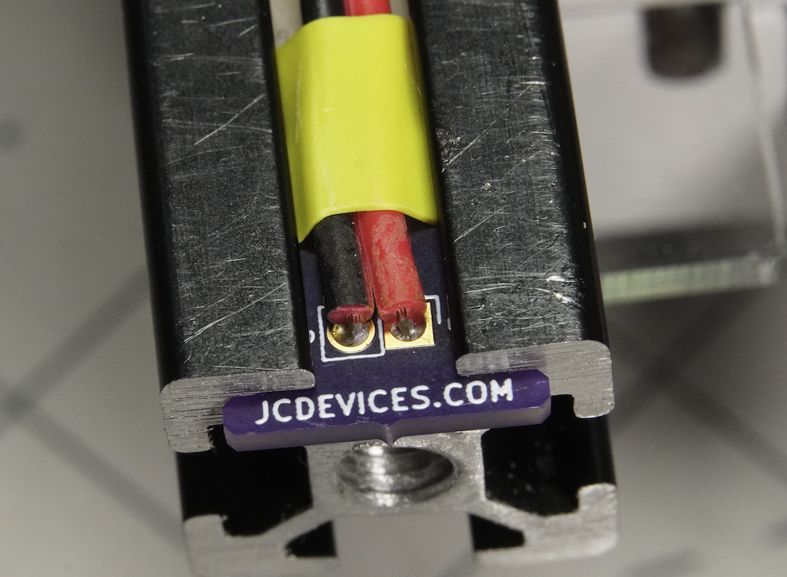

Adapters to make soldering onto LED strips easier

2020-light-adapter is a soldering fixture PCB for non-addressable LEDs, and fits into 2020 extrusion.

ws2812-light-adapter is a soldering fixture PCB for addressable LEDs, which MAY fit into 2020 extrusion,  
but has primarilly been used as a solder helper.

Both feature cut-off tabs that can be used to make the whole thing slide into the extrusion. Or they  
can be left off if you prefer to keep it at the edge of your design. What is shown in the image below  
is an early version without holes in the tabs for easy removal.

