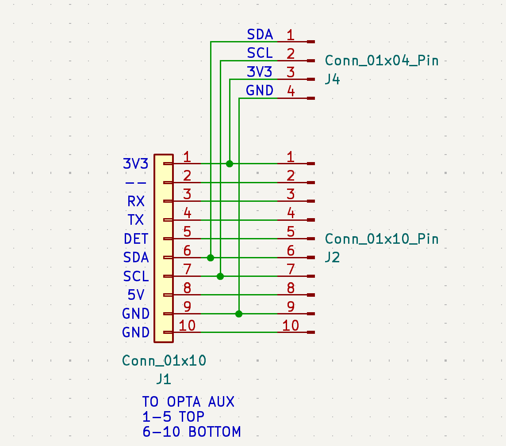

Breakout for the Arduino Aux port

Available for purchase as a kit on Tindie: https://www.tindie.com/products/35482

*SCHEMATIC ABOVE IS CURRENT VERSION, GERBERS ARE PREVIOUS VERSION WITHOUT EXTRA SSD1306 I2C BREAKOUT

Video 1: https://www.youtube.com/watch?v=uI7lgpYqT7I

Video 2 (MIDI):  https://www.youtube.com/watch?v=I1bTBb1HK34

Use with card edge connector: KYOCERA AVX # 009159010061916
